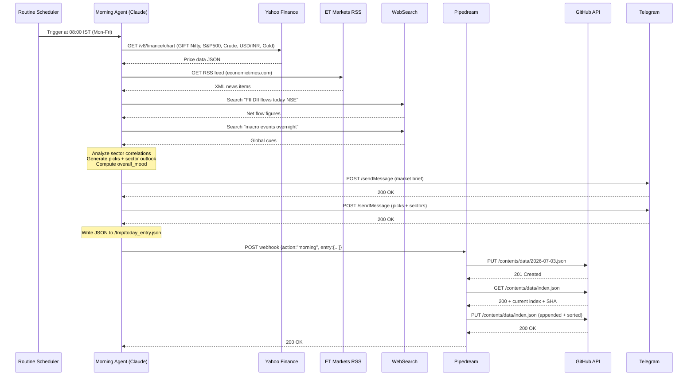
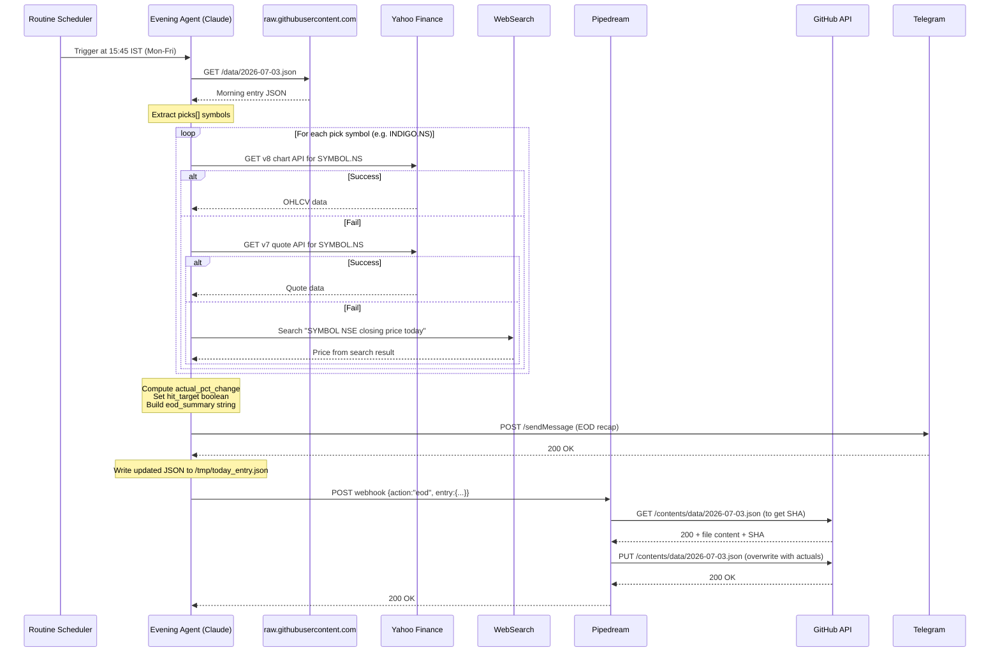
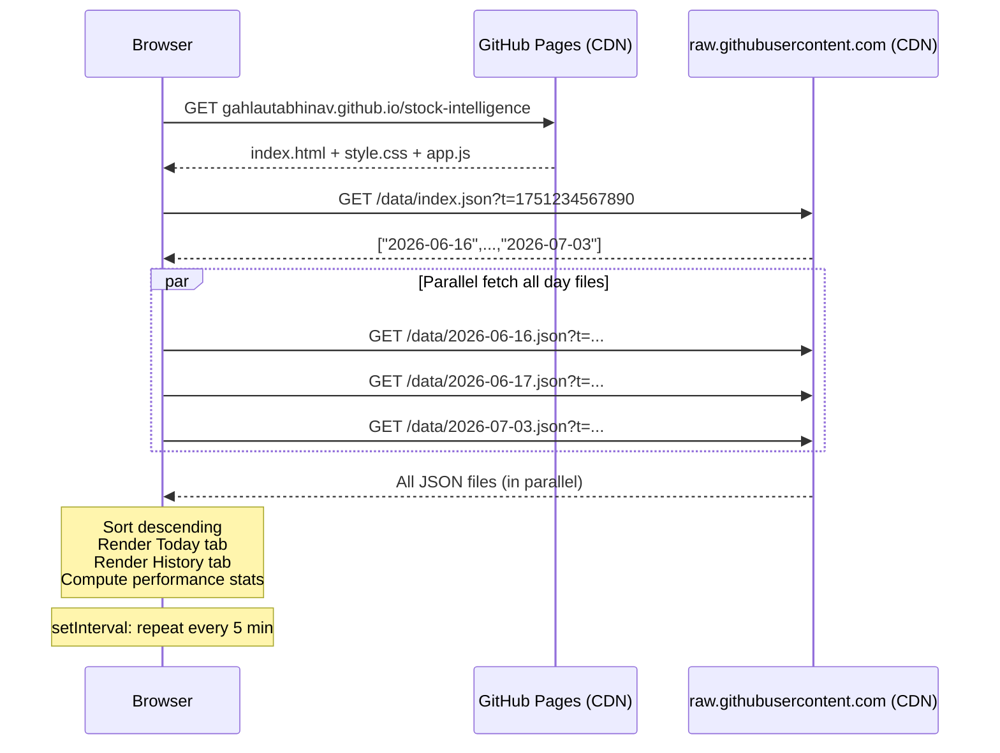

# Stock Intelligence PA — Architecture Reference

> Deep technical reference. For setup and usage, see README.md.
> Last updated: 2026-07-03

---

## Table of Contents

1. [System Overview](#1-system-overview)
2. [Component Map](#2-component-map)
3. [Full Data Flow](#3-full-data-flow)
4. [Cloud Agents](#4-cloud-agents)
5. [Pipedream Relay](#5-pipedream-relay)
6. [Data Layer](#6-data-layer)
7. [GitHub Pages Dashboard](#7-github-pages-dashboard)
8. [Telegram Delivery](#8-telegram-delivery)
9. [JSON Schema Reference](#9-json-schema-reference)
10. [Repository Structure](#10-repository-structure)
11. [Key Design Decisions](#11-key-design-decisions)
12. [Hard Constraints](#12-hard-constraints)
13. [Known Failure Modes & Mitigations](#13-known-failure-modes--mitigations)
14. [Cost Breakdown](#14-cost-breakdown)
15. [Operations Guide](#15-operations-guide)
16. [Sequence Diagrams](#16-sequence-diagrams)

---

## 1. System Overview

Stock Intelligence PA is a fully automated, zero-infrastructure pre-market intelligence system for NSE (India) trading. It runs entirely on cloud services at no cost.

**Problem it solves:** Intraday opportunities on NSE are macro-correlated (e.g., a crude oil overnight drop makes airline stocks bullish at open). By the time a trader reads the news manually, the move has already happened. This system delivers a structured, actionable brief at 8:00 AM IST — before NSE opens at 9:15 AM — and reconciles picks against actual market close data at 3:45 PM IST.

**What it does not do:** This is a personal intelligence assistant, not a trading execution system. It produces analysis and picks for human review. Nothing touches a brokerage API.

### System Goals

| Goal | How it is achieved |
|------|--------------------|
| Deliver brief before NSE open | Morning agent scheduled 8:00 AM IST via claude.ai routine |
| Zero manual intervention | Fully automated via Anthropic cloud routines (Mon–Fri) |
| Accurate pick tracking | Evening agent fetches actual NSE close prices and updates JSON |
| Accessible anywhere | GitHub Pages dashboard — no login, no app to install |
| No recurring cost | All components on free tiers |

---

## 2. Component Map

```
┌─────────────────────────────────────────────────────────────────────┐
│                      EXTERNAL DATA SOURCES                          │
│                                                                     │
│  Yahoo Finance (REST)    ET Markets (RSS)    Web Search (Brave/Bing)│
│  finance.yahoo.com       economictimes.com    (FII/DII flows, macro) │
└────────────┬─────────────────────────┬───────────────┬─────────────┘
             │                         │               │
             ▼                         ▼               ▼
┌─────────────────────────────────────────────────────────────────────┐
│                    ANTHROPIC CLOUD (claude.ai/code)                 │
│                                                                     │
│  ┌──────────────────────────────┐  ┌──────────────────────────────┐ │
│  │     MORNING AGENT            │  │     EVENING AGENT            │ │
│  │  Routine: trig_014yZyW2H8   │  │  Routine: trig_01FXHWTMHq   │ │
│  │  Schedule: 8:00 AM IST      │  │  Schedule: 3:45 PM IST       │ │
│  │  Mon–Fri only               │  │  Mon–Fri only                │ │
│  │                              │  │                              │ │
│  │  1. Fetch Yahoo Finance      │  │  1. Read today's entry       │ │
│  │  2. Parse ET RSS             │  │     via raw.githubusercontent │ │
│  │  3. WebSearch FII/macro      │  │  2. Fetch .NS close prices   │ │
│  │  4. Analyze correlations     │  │     (3-source fallback)      │ │
│  │  5. Generate JSON entry      │  │  3. Update picks with        │ │
│  │  6. POST → Pipedream         │  │     actual_open/close/pct    │ │
│  │  7. Send 2 Telegram msgs     │  │  4. POST → Pipedream         │ │
│  └──────────────┬───────────────┘  │  5. Send EOD Telegram recap  │ │
│                 │                  └───────────────┬──────────────┘ │
└─────────────────│──────────────────────────────────│────────────────┘
                  │                                  │
                  │  HTTPS POST (JSON)               │  HTTPS POST (JSON)
                  ▼                                  ▼
┌─────────────────────────────────────────────────────────────────────┐
│                        PIPEDREAM                                    │
│            Webhook: eoivnuika9xqmn2.m.pipedream.net                 │
│            Workflow: "stock-intel"                                  │
│                                                                     │
│  Receives: { "action": "morning"|"eod", "entry": {...} }           │
│                                                                     │
│  morning → Create data/YYYY-MM-DD.json                              │
│           → Update data/index.json (append + sort)                  │
│  eod     → Overwrite data/YYYY-MM-DD.json (with actuals)           │
│                                                                     │
│  Uses: GitHub API (api.github.com) via Node.js — no proxy          │
└─────────────────────────┬───────────────────────────────────────────┘
                          │
                          │  GitHub REST API (PAT auth)
                          ▼
┌─────────────────────────────────────────────────────────────────────┐
│              GITHUB REPO: gahlautabhinav/stock-intelligence         │
│                                                                     │
│  data/                                                              │
│  ├── index.json          ← sorted array of all trading dates        │
│  ├── 2026-06-16.json                                                │
│  ├── 2026-06-17.json                                                │
│  └── ...                                                            │
│                                                                     │
│  docs/                   ← served by GitHub Pages                   │
│  ├── index.html                                                     │
│  ├── style.css                                                      │
│  └── app.js                                                         │
└──────────────────────────────┬──────────────────────────────────────┘
                               │
          ┌────────────────────┼────────────────────┐
          │                    │                    │
          ▼                    ▼                    ▼
┌──────────────┐    ┌──────────────────┐   ┌─────────────────┐
│   TELEGRAM   │    │   GITHUB PAGES   │   │  raw.github     │
│              │    │  (docs/ folder)  │   │  (CDN reads)    │
│  Morning     │    │                  │   │                 │
│  brief (×2)  │    │  dashboard SPA   │   │  Agent reads    │
│              │    │  auto-refreshes  │   │  today's entry  │
│  EOD recap   │    │  every 5 min     │   │  (no auth)      │
│  (×1)        │    │                  │   │                 │
└──────────────┘    └──────────────────┘   └─────────────────┘
                           ▲
                    Browser fetches
                    raw.githubusercontent.com
                    (same CDN, no GitHub API)
```

---

## 3. Full Data Flow

### Morning Flow (8:00 AM IST)

```
Yahoo Finance (v8 JSON API)
├── GIFT Nifty futures (%5ENSEI proxy)
├── S&P 500 (^GSPC)
├── Crude Oil (CL=F)
├── USD/INR (INR=X)
└── Gold (GC=F)
              │
              ├──── ET Markets RSS feed (economictimes.com)
              │     └── Top India business headlines
              │
              ├──── WebSearch
              │     ├── FII/DII net flows (previous session)
              │     └── Macro events (Fed, RBI, global cues)
              │
              ▼
    Morning Agent (Claude claude-sonnet-4-6 on Anthropic Cloud)
              │
              │   Sector correlation analysis:
              │   - Crude ↓ → Airlines, Paints, Logistics BULLISH
              │   - USD/INR ↑ → IT exporters BULLISH, importers BEARISH
              │   - FII buying → broad market BULLISH
              │   - Gold ↑ → risk-off signal → CAUTIOUS
              │
              ▼
    Structured JSON entry generated
              │
       ┌──────┴──────────────┐
       │                     │
       ▼                     ▼
  Telegram API         Pipedream Webhook
  (2 messages)         POST {"action":"morning","entry":{...}}
  - Morning brief            │
  - Top picks detail         ▼
                       Pipedream Node.js
                             │
                    ┌────────┴────────┐
                    │                 │
                    ▼                 ▼
             GitHub API         GitHub API
             PUT data/          PUT data/
             2026-07-03.json    index.json
             (create new)       (append date, sort)
                    │
                    ▼
             GitHub Pages CDN propagates within ~30s
```

### Evening Flow (3:45 PM IST)

```
raw.githubusercontent.com
└── data/2026-07-03.json   ← today's morning entry (no auth, no proxy)
              │
              ▼
    Evening Agent reads picks[] from entry
              │
              ▼
    For each pick symbol (e.g., INDIGO.NS):
    ├── Try Yahoo Finance v8 API  (primary)
    ├── Try Yahoo Finance v7 API  (fallback 1)
    └── Try WebSearch "INDIGO NSE close price today"  (fallback 2)
              │
              ▼
    Enriched JSON:
    picks[i].actual_open         = NSE opening price
    picks[i].actual_close        = NSE closing price
    picks[i].actual_pct_change   = (close - open) / open × 100
    picks[i].hit_target          = actual_pct_change >= target_pct
    entry.eod_updated            = true
    entry.eod_summary            = "INDIGO +1.73% ✅  BAJFINANCE -0.4% ❌"
              │
       ┌──────┴──────────────┐
       │                     │
       ▼                     ▼
  Telegram API         Pipedream Webhook
  (1 EOD message)      POST {"action":"eod","entry":{...}}
  - Accuracy stats           │
  - Per-pick result          ▼
                       Pipedream Node.js
                             │
                             ▼
                       GitHub API
                       PUT data/2026-07-03.json
                       (overwrite with actuals)
```

### Dashboard Read Flow (browser, any time)

```
Browser loads https://gahlautabhinav.github.io/stock-intelligence
              │
              ▼
  docs/index.html → loads docs/style.css + docs/app.js
              │
              ▼
  app.js: fetch https://raw.githubusercontent.com/.../data/index.json
              │
              ▼
  Parse: ["2026-06-16", "2026-06-17", ..., "2026-07-03"]
              │
              ▼
  Promise.all() → parallel fetch all per-day files
  raw.githubusercontent.com/.../data/2026-06-16.json
  raw.githubusercontent.com/.../data/2026-06-17.json
  ...
              │
              ▼
  Sort descending by date → render UI
  Auto-repeat every 5 minutes (setInterval)
```

---

## 4. Cloud Agents

Both agents run on **claude.ai/code routines** — Anthropic's scheduled cloud execution environment. They have no persistent state between runs. Each run is a fresh Claude session executing a structured prompt.

### 4.1 Morning Agent

| Attribute | Value |
|-----------|-------|
| Routine ID | `trig_014yZyW2H8Mpq2GQeMsG5SDy` |
| Schedule | 8:00 AM IST, Monday–Friday |
| Model | claude-sonnet-4-6 |
| Cloud Environment ID | `env_01F43Fu7teMY2kT4rS1cdDWn` |
| Prompt file (local) | `agents/morning-agent-prompt.md` |

**Execution steps inside the prompt:**

1. **Fetch global snapshot** — Yahoo Finance JSON API for GIFT Nifty, S&P 500, Crude Oil, USD/INR, Gold
2. **Fetch India news** — ET Markets RSS (economictimes.com) parsed via `urllib` in an inline Python heredoc
3. **WebSearch** — FII/DII net flows from previous session, key macro events overnight
4. **Sector correlation analysis** — Claude reasons over the data: crude change → energy/airline/paints impact; FII flow direction → broad market tone; USD/INR move → IT/pharma vs import-heavy sectors
5. **JSON construction** — Output formatted as the per-day schema (see Section 9)
6. **Write to GitHub** — Two-part block: Part A writes JSON to `/tmp/today_entry.json`; Part B reads it and POSTs to Pipedream via `urllib.request`
7. **Telegram** — Two messages sent inline: (1) market mood + snapshot + FII (2) sector outlook + top picks

**Why two Telegram messages:** Telegram has a 4096-character limit per message. The full brief exceeds this. Message 1 covers the macro picture; Message 2 covers picks and sector calls.

### 4.2 Evening Agent

| Attribute | Value |
|-----------|-------|
| Routine ID | `trig_01FXHWTMHqss4oNU6b9KGJ1D` |
| Schedule | 3:45 PM IST, Monday–Friday |
| Model | claude-sonnet-4-6 |
| Prompt file (local) | `agents/evening-agent-prompt.md` |

**Execution steps inside the prompt:**

1. **Read morning entry** — Fetches `https://raw.githubusercontent.com/gahlautabhinav/stock-intelligence/main/data/YYYY-MM-DD.json` (today's date computed inline). This path is not blocked by Anthropic's proxy.
2. **Fetch NSE closing prices** — For each pick symbol, tries three sources in order:
   - Yahoo Finance v8 API (`query1.finance.yahoo.com/v8/finance/chart/SYMBOL.NS`)
   - Yahoo Finance v7 API (`query1.finance.yahoo.com/v7/finance/quote?symbols=SYMBOL.NS`)
   - WebSearch fallback (`"SYMBOL NSE close price today"`)
3. **Compute actuals** — Calculates `actual_pct_change`, sets `hit_target` boolean
4. **Write updated entry** — Two-part block, same pattern as morning
5. **Send EOD Telegram** — Single message with accuracy summary

### 4.3 Two-Part Agent Block Pattern

Both agents use a specific prompt engineering pattern to prevent a known bug:

```
# Part A — agent pastes actual JSON values here
cat > /tmp/today_entry.json << 'JSONEOF'
{
  "date": "2026-07-03",
  ...actual computed values...
}
JSONEOF

# Part B — fixed code, never modified by agent
python3 - << 'PYEOF'
import json, urllib.request, urllib.parse
with open('/tmp/today_entry.json') as f:
    entry = json.load(f)

payload = json.dumps({"action": "morning", "entry": entry}).encode()
req = urllib.request.Request(
    "https://eoivnuika9xqmn2.m.pipedream.net",
    data=payload,
    headers={"Content-Type": "application/json"},
    method="POST"
)
resp = urllib.request.urlopen(req, timeout=30)
print(resp.read().decode()[:300])
PYEOF
```

**Why this pattern exists:** In an earlier design, the prompt asked the agent to fill a Python variable: `entry = PASTE_ACTUAL_ENTRY_DICT_HERE`. The agent would sometimes replace this with a Python variable name (e.g., `entry = today_data`) instead of the actual dict literal, causing a `NameError` at runtime. The agent would then report "GitHub write failed — proxy blocked" masking the real error. The two-part pattern forces the agent to produce valid JSON in Part A, which Part B reads from disk — the Python code in Part B is never modified by the agent.

---

## 5. Pipedream Relay

### 5.1 Why It Exists

Anthropic's cloud agent execution environment routes all outbound HTTP through a proxy. This proxy **blocks all write operations to `api.github.com`** with HTTP 403:

```
403 Forbidden
"Write access to this GitHub API path is not permitted through this proxy"
```

This applies to: PUT, POST, PATCH, DELETE on `api.github.com`. It does **not** block:
- `raw.githubusercontent.com` (CDN reads — used for reading data files)
- `api.telegram.org` (if added to the network egress allowlist)
- All other non-GitHub-API endpoints

Pipedream acts as an untethered relay: the agent POSTs JSON to a Pipedream webhook URL, and a Node.js step inside Pipedream writes to the GitHub API using a PAT. Pipedream has no such proxy restriction.

### 5.2 Webhook Specification

| Attribute | Value |
|-----------|-------|
| URL | `https://eoivnuika9xqmn2.m.pipedream.net` |
| Method | POST |
| Content-Type | `application/json` |
| Workflow name | `stock-intel` |
| Source | `pipedream-workflow.js` (git-ignored, contains PAT) |

**Request payload:**

```json
// Morning write
{
  "action": "morning",
  "entry": { ...full per-day schema... }
}

// Evening update
{
  "action": "eod",
  "entry": { ...per-day schema with actuals added... }
}
```

### 5.3 Pipedream Workflow Logic (Node.js)

```
Receive HTTP trigger
    │
    ├── action === "morning"
    │     ├── GitHub API: PUT /repos/gahlautabhinav/stock-intelligence/contents/data/YYYY-MM-DD.json
    │     │   (creates new file, base64-encodes JSON)
    │     └── GitHub API: GET then PUT /repos/.../contents/data/index.json
    │         (reads current index, appends new date, deduplicates, sorts, writes back)
    │
    └── action === "eod"
          └── GitHub API: GET then PUT /repos/.../contents/data/YYYY-MM-DD.json
              (reads existing file to get SHA, overwrites with updated entry)
```

All GitHub API calls use a Personal Access Token (PAT) with `repo` scope. The PAT is stored in the Pipedream workflow environment — never in the git repository.

### 5.4 Why Not a GitHub Action

GitHub Actions could in theory do this (triggered by repository_dispatch). However:
- It would require the agent to make an API call to `api.github.com/repos/.../dispatches` — which is also blocked by Anthropic's proxy
- There is no way for the cloud agent to trigger a GitHub Action without going through the blocked API

Pipedream's free tier (100 invocations/day) comfortably covers 2 invocations per weekday (40/month), with headroom for manual reruns.

---

## 6. Data Layer

The data layer is the GitHub repository's `data/` folder, served as static JSON files via `raw.githubusercontent.com`.

### 6.1 Architecture: Per-Day Files

```
data/
├── index.json          ← directory of all dates
├── 2026-06-16.json     ← one file per trading day
├── 2026-06-17.json
├── 2026-06-18.json
├── 2026-06-19.json
├── 2026-06-20.json
├── 2026-06-23.json
└── 2026-07-03.json
```

**index.json structure:**

```json
["2026-06-16","2026-06-17","2026-06-18","2026-06-19","2026-06-20","2026-06-23","2026-07-03"]
```

Sorted ascending (oldest first). Dashboard sorts descending for display.

### 6.2 Design: Why Per-Day Files

Three alternatives were considered:

| Approach | Problem |
|----------|---------|
| Single `briefings.json` (append-only array) | Evening agent must read the full array, find today's entry by date, modify it, and write the entire array back. Risk of race condition if file is large. GitHub API requires reading the file first (to get its SHA), then writing — doubling API calls. |
| Database (Supabase, Firebase, etc.) | Introduces a paid service dependency and requires the agent to authenticate to yet another API. |
| Per-day files + index.json | Evening agent only needs to overwrite one small file (today's). No array parsing. No merge conflicts possible. Index grows by one line per trading day. |

The per-day approach trades a slightly more complex dashboard fetch (parallel requests) for a much simpler write path in both agents.

### 6.3 Update Lifecycle

```
Day start (8:00 AM IST):
  data/2026-07-03.json  ← CREATED by morning agent
  data/index.json       ← "2026-07-03" APPENDED

Day end (3:45 PM IST):
  data/2026-07-03.json  ← OVERWRITTEN by evening agent
                           (same structure, picks now have actual_* fields)
  data/index.json       ← unchanged (date already in index)
```

### 6.4 Access Patterns

| Consumer | Endpoint | Auth | Frequency |
|----------|----------|------|-----------|
| Evening agent (read) | `raw.githubusercontent.com/...data/YYYY-MM-DD.json` | None (public repo) | Once per day |
| Dashboard (read index) | `raw.githubusercontent.com/...data/index.json` | None | Every 5 min |
| Dashboard (read day files) | `raw.githubusercontent.com/...data/YYYY-MM-DD.json` | None | Every 5 min (all files in parallel) |
| Pipedream (write) | `api.github.com/repos/.../contents/data/...` | PAT | Twice per day |

All reads go through `raw.githubusercontent.com` — GitHub's CDN for raw file content. No API authentication needed. Responses are cached at the CDN edge; the dashboard adds a cache-busting `?t=Date.now()` query parameter to each request to ensure freshness.

---

## 7. GitHub Pages Dashboard

### 7.1 Deployment

Deployed via GitHub Actions on every push to `main`. The workflow (`.github/workflows/pages.yml`) uploads the `docs/` folder as a Pages artifact and deploys it. No build step — pure static HTML/CSS/JS.

```
Push to main
    │
    ▼
GitHub Action: Deploy GitHub Pages
    ├── actions/checkout@v4
    ├── actions/configure-pages@v5
    ├── actions/upload-pages-artifact@v3 (path: ./docs)
    └── actions/deploy-pages@v4
```

Live URL: `https://gahlautabhinav.github.io/stock-intelligence`

### 7.2 Application Architecture

Single-page application in vanilla JavaScript. No framework, no bundler, no build step.

```
index.html
├── Imports: style.css, app.js
└── Imports: LightweightCharts v4 (CDN, unpkg.com)

app.js — ~700 lines, organized as:
├── Config (BASE_RAW URL, REFRESH_MS = 5min)
├── State (briefings[], _charts{})
├── Init (DOMContentLoaded → loadData + setInterval)
├── Theme (localStorage, data-theme attribute on <html>)
├── Data (loadData → fetch index → parallel fetch days)
├── Tabs (Today / History / Performance)
├── Renderers
│   ├── renderToday()
│   ├── renderHistory() + renderHistoryRow()
│   ├── renderStats()
│   ├── renderMoodBanner()
│   ├── renderFIIBanner()
│   ├── renderSnapshot()
│   ├── renderNewsList()
│   ├── renderSectors()
│   ├── renderPicks()
│   └── renderRisks()
├── Charts (LightweightCharts)
│   ├── renderCharts() — entry point (lazy: only fires when Performance tab active)
│   ├── renderSnapshotChart() — line chart per macro metric
│   ├── makeChart() — factory with theme-aware config
│   └── renderSectorHeatmap() — CSS table grid (not LightweightCharts)
└── Helpers (todayStr, fmtDate, fmtTime, calcAccuracy, updateMarketStatus)
```

### 7.3 Data Fetching

```javascript
// Cache-busted parallel fetch of all day files
const t = Date.now();
const idxRes = await fetch(INDEX_URL + '?t=' + t);
const dates  = await idxRes.json();
const dayFiles = await Promise.all(
  dates.map(date =>
    fetch(`${BASE_RAW}/data/${date}.json?t=${t}`)
      .then(r => r.ok ? r.json() : null)
      .catch(() => null)   // bad file → null, filtered out
  )
);
briefings = dayFiles.filter(Boolean);
```

**Fallback:** If the index-based fetch fails entirely, `loadData` falls back to the legacy `data/briefings.json` (the old monolithic array, preserved for backward compatibility).

### 7.4 Performance Tab and Chart Rendering

LightweightCharts uses `autoSize: true` to fill its container. When the Performance tab is hidden (display: none), the container measures 0×0 pixels, resulting in invisible charts. To avoid this:

- `renderCharts()` is called only when the Performance tab is clicked (tab `click` handler) and on initial load only if that tab is already active
- `makeChart()` destroys any existing chart instance before creating a new one to avoid DOM leaks on theme switches

### 7.5 Tabs

| Tab | Content | Data source |
|-----|---------|-------------|
| Today | Today's full brief (mood, FII, snapshot, news, sectors, picks, EOD results if available) | `briefings.find(x => x.date === todayStr()) \|\| briefings[0]` |
| History | Collapsible rows for all past days, sorted descending | All `briefings[]`, mapped to expandable rows |
| Performance | Aggregate stats (win rate, avg move), per-stock table, macro trend charts, sector heatmap | Computed from all `briefings[]` |

### 7.6 Market Status Indicator

Computed client-side from browser clock converted to IST:

```
09:15–15:30 IST, Mon–Fri   → "Open"       (green)
08:00–09:15 IST, Mon–Fri   → "Pre-Market" (amber)
All other times             → "Closed"     (gray)
Sat–Sun                    → "Closed"
```

---

## 8. Telegram Delivery

### 8.1 Bot Configuration

| Attribute | Value |
|-----------|-------|
| Bot token | Stored in `agents/morning-agent-prompt.md` (git-ignored) |
| Chat ID | Stored in agent prompts (git-ignored) |
| API endpoint | `https://api.telegram.org/bot{TOKEN}/sendMessage` |

**Critical:** Telegram's API (`api.telegram.org`) is blocked by Anthropic's cloud egress by default. It must be explicitly added to the network allowlist in **claude.ai/code → Settings → Environment → Network**. This is a one-time setup per cloud environment. If the environment ID changes, this must be reconfigured.

### 8.2 Send Pattern

All Telegram messages use this exact pattern — no deviations:

```python
python3 - << 'PYEOF'
import urllib.request, urllib.parse
TOKEN   = "..."
CHAT_ID = "..."
URL     = "https://api.telegram.org/bot" + TOKEN + "/sendMessage"
msg = """YOUR MESSAGE TEXT HERE"""
data = urllib.parse.urlencode({"chat_id": CHAT_ID, "text": msg}).encode("utf-8")
req  = urllib.request.Request(URL, data=data, method="POST")
try:
    resp = urllib.request.urlopen(req, timeout=20)
    print("RESULT:", resp.read().decode()[:200])
except Exception as e:
    print("ERROR:", str(e))
PYEOF
```

**No `parse_mode`.** The `parse_mode=HTML` parameter was removed after the ampersand in "S&P 500" triggered Telegram's HTML parser and returned HTTP 400. Plain text mode has no such edge cases.

**No `requests` library.** Cloud agents may not have `requests` installed. `urllib` is Python stdlib — always available.

**No temp files for Telegram.** Messages are short enough to embed inline. Temp files are only used for the JSON payload sent to Pipedream (to prevent the agent from treating Python variable names as literal values).

### 8.3 Message Structure

**Morning message 1** (sent ~8:00 AM IST):
```
STOCK INTELLIGENCE PA — [Date] [Day]
Market Mood: BULLISH/BEARISH/CAUTIOUS/NEUTRAL

MARKET SNAPSHOT:
GIFT Nifty: 24,280 (+0.74%)
S&P 500: 5,890 (+0.31%)
Crude Oil: $78.5/bbl (-1.20%)
USD/INR: ₹83.40 (+0.05%)
Gold: $2,340/oz (+0.20%)

FII/DII: Net Buyers ₹450 Cr (prev session)

KEY MACRO EVENTS:
• [Event 1]
• [Event 2]
```

**Morning message 2** (sent immediately after):
```
SECTOR OUTLOOK:
• Airlines: BULLISH — Crude -1.2%
• IT: BULLISH — Weak INR
• FMCG: NEUTRAL

TOP PICKS:
1. INDIGO.NS
   Catalyst: Crude oil -1.2% overnight
   Watch zone: ₹4,850–4,920 | Target: +2.5% | SL: ₹4,800
   Logic: ...

RISKS: RBI surprise, Global risk-off
```

**Evening message** (sent ~3:45 PM IST):
```
EOD RECAP — [Date]
Picks Result: 2/3 correct (67%)

✅ INDIGO: +1.73% (Target was +2.5% — near miss, still directionally correct)
❌ BAJFINANCE: -0.4% (Target +1.8%)
✅ TITAN: +2.1% (Target +1.5% — exceeded)

Avg actual move: +1.1%
```

---

## 9. JSON Schema Reference

### Per-Day File (`data/YYYY-MM-DD.json`)

```json
{
  "date": "2026-07-03",
  "day": "Thursday",

  "snapshot": {
    "gift_nifty": { "value": 24280,  "change_pct": 0.74  },
    "sp500":      { "value": 5890,   "change_pct": 0.31  },
    "crude_oil":  { "value": 78.5,   "change_pct": -1.20 },
    "usd_inr":    { "value": 83.40,  "change_pct": 0.05  },
    "gold":       { "value": 2340,   "change_pct": 0.20  }
  },

  "fii": {
    "net_cr": 450,
    "direction": "buying"
  },

  "news": [
    {
      "headline": "Crude oil falls 1.2% on demand fears",
      "what_happened": "WTI crude dropped overnight after IEA revised demand estimates downward.",
      "why_it_matters": "Lower crude reduces input costs for airlines, paints, and logistics.",
      "affected_stocks": ["INDIGO", "INTERGLOBE", "ASIANPAINT"],
      "sentiment": "bullish"
    }
  ],

  "sector_outlook": [
    { "sector": "Airlines",    "outlook": "BULLISH",  "reason": "Crude -1.2%" },
    { "sector": "IT",          "outlook": "BULLISH",  "reason": "INR weak, exports benefit" },
    { "sector": "Oil & Gas",   "outlook": "BEARISH",  "reason": "Crude down" },
    { "sector": "Auto",        "outlook": "NEUTRAL",  "reason": "Mixed signals" }
  ],

  "picks": [
    {
      "symbol": "INDIGO",
      "catalyst": "Crude oil -1.2%",
      "logic": "IndiGo's largest cost is aviation turbine fuel. A 1%+ overnight drop in crude reduces ATF costs and typically moves the stock 1.5–2.5% at NSE open.",
      "watch_zone": { "low": 4850, "high": 4920 },
      "target_pct": 2.5,
      "stop_loss": 4800,

      "actual_open": 4905,
      "actual_close": 4990,
      "actual_pct_change": 1.73,
      "hit_target": false
    }
  ],

  "overall_mood": "BULLISH",

  "risks": [
    "RBI surprise rate decision",
    "Global risk-off if US jobs data disappoints"
  ],

  "eod_updated": true,
  "eod_summary": "INDIGO +1.73% (target missed, direction correct)"
}
```

### Field Reference

| Field | Type | Set by | Notes |
|-------|------|--------|-------|
| `date` | string | Morning agent | ISO 8601 date `YYYY-MM-DD` |
| `day` | string | Morning agent | Full weekday name |
| `snapshot.*` | object | Morning agent | All five macro indicators |
| `snapshot.*.value` | number | Morning agent | Absolute price |
| `snapshot.*.change_pct` | number | Morning agent | % change from prior close |
| `fii.net_cr` | number | Morning agent | FII net in crores (positive = buying) |
| `fii.direction` | string | Morning agent | `"buying"` or `"selling"` |
| `news[]` | array | Morning agent | 3–5 items typical |
| `news[].sentiment` | string | Morning agent | `"bullish"`, `"bearish"`, or `"neutral"` |
| `sector_outlook[]` | array | Morning agent | `outlook`: `"BULLISH"`, `"BEARISH"`, `"NEUTRAL"` |
| `picks[]` | array | Morning agent | 2–4 items typical |
| `picks[].watch_zone` | object | Morning agent | Entry zone `{low, high}` |
| `picks[].target_pct` | number | Morning agent | Expected % move from watch zone low |
| `picks[].stop_loss` | number | Morning agent | Absolute price |
| `picks[].actual_open` | number | Evening agent | NSE opening price |
| `picks[].actual_close` | number | Evening agent | NSE closing price |
| `picks[].actual_pct_change` | number | Evening agent | `(close-open)/open × 100` |
| `picks[].hit_target` | boolean | Evening agent | `actual_pct_change >= target_pct` |
| `overall_mood` | string | Morning agent | `"BULLISH"`, `"BEARISH"`, `"CAUTIOUS"`, `"NEUTRAL"` |
| `risks[]` | array | Morning agent | String array |
| `eod_updated` | boolean | Evening agent | `true` after EOD run |
| `eod_summary` | string | Evening agent | Human-readable EOD recap |

### Index File (`data/index.json`)

```json
["2026-06-16","2026-06-17","2026-06-18","2026-06-19","2026-06-20","2026-06-23","2026-07-03"]
```

Plain sorted array of date strings (ISO 8601). One entry per trading day. Sorted ascending. New dates appended by Pipedream morning write, deduplicated and re-sorted before writing.

---

## 10. Repository Structure

```
stock-intelligence/
│
├── data/                          ← Data layer (JSON files)
│   ├── index.json                 ← Sorted array of all briefing dates
│   ├── 2026-06-16.json            ← Per-day briefing + actuals
│   ├── 2026-06-17.json
│   └── ...
│
├── docs/                          ← GitHub Pages root
│   ├── index.html                 ← SPA shell (header, tabs, main, footer)
│   ├── style.css                  ← All styles (dark/light, responsive)
│   └── app.js                     ← All JavaScript (~700 lines, no framework)
│
├── .github/
│   └── workflows/
│       └── pages.yml              ← Deploy docs/ to GitHub Pages on push
│
├── .gitignore                     ← agents/, pipedream-workflow.js, *.txt
├── README.md
└── ARCHITECTURE.md                ← This file

─── Git-ignored (local only) ──────────────────────────────────────────

agents/
├── morning-agent-prompt.md        ← Full morning prompt + credentials
└── evening-agent-prompt.md        ← Full evening prompt + credentials

pipedream-workflow.js              ← Pipedream Node.js code with GitHub PAT
telegram-bot.txt                   ← Bot token reference
```

**What is git-ignored and why:**

| Path | Contains | Why ignored |
|------|----------|-------------|
| `agents/` | GitHub PAT, Telegram bot token, chat ID | Credentials must never enter version history |
| `pipedream-workflow.js` | GitHub PAT | Same reason; also this is for reference only — the live code runs in Pipedream's cloud |
| `telegram-bot.txt` | Bot token | Credentials |

---

## 11. Key Design Decisions

### Decision 1: Zero-infrastructure, no servers

**Chosen:** Claude.ai cloud routines + Pipedream + GitHub Pages + raw.githubusercontent.com

**Rejected:** VPS/EC2 running a cron job + Python script

**Reasoning:** A server requires maintenance, monitoring, patching, and costs money. The cloud routine approach runs entirely on existing subscriptions. The operational overhead on a personal project is near zero.

---

### Decision 2: Pipedream as GitHub write relay

**Chosen:** Agent → Pipedream webhook → GitHub API

**Rejected:** (a) Direct GitHub API from agent, (b) GitHub Actions triggered via repository_dispatch

**Reasoning:** Anthropic's proxy blocks all `api.github.com` write operations. This is a hard constraint, not configurable. Option (b) was also blocked because triggering a GitHub Action requires a POST to `api.github.com/repos/.../dispatches` — the same blocked endpoint. Pipedream's free tier covers this use case with 2 invocations per day.

---

### Decision 3: Per-day files over single monolithic JSON

**Chosen:** `data/YYYY-MM-DD.json` + `data/index.json`

**Rejected:** Single `data/briefings.json` append-only array

**Reasoning:** The evening agent needs to update one entry in the dataset. With a monolithic array, it would need to: read the full file, parse it, find today's entry, merge in actuals, serialize the whole array, and write it back. With per-day files, the evening agent overwrites exactly one file. Simpler, no merge risk, and the index grows by only one date string per day.

---

### Decision 4: raw.githubusercontent.com for reads, Pipedream for writes

**Chosen:** Split read/write paths — reads via CDN, writes via Pipedream relay

**Rejected:** All reads/writes through GitHub API

**Reasoning:** `raw.githubusercontent.com` is not blocked by Anthropic's proxy and requires no authentication for public repos. It's also faster (CDN) and more reliable than the GitHub REST API for read operations. The asymmetric design (CDN reads, relay writes) cleanly works within the constraints.

---

### Decision 5: urllib, not requests

**Chosen:** `urllib.request` (Python stdlib)

**Rejected:** `requests`, `httpx`, or other third-party libraries

**Reasoning:** Cloud agent execution environments have Python available but may not have third-party packages pre-installed. `urllib` is always available with no installation step. The slight verbosity is acceptable for scripts that are 10–15 lines long.

---

### Decision 6: Two-part heredoc blocks

**Chosen:** Part A writes JSON to temp file; Part B reads file and POSTs

**Rejected:** Single Python block where agent fills in a variable

**Reasoning:** When prompted to substitute a dict literal, Claude sometimes writes a descriptive variable name (`entry = today_briefing_data`) instead of the actual computed values. This causes a `NameError` at runtime. The agent then interprets the Python error as a GitHub proxy block (since the POST never happens), reporting the wrong failure mode. The two-part pattern forces actual JSON in Part A (where the agent can write free-form) and keeps Part B as fixed, agent-unmodified code.

---

### Decision 7: No `parse_mode` in Telegram

**Chosen:** Plain text messages, no `parse_mode` parameter

**Rejected:** `parse_mode=HTML` for bold/italic formatting

**Reasoning:** Telegram's HTML parser is strict. The ampersand in "S&P 500" caused Telegram to return HTTP 400 ("Bad Request: can't parse entities"). Escaping all such characters in the agent's output is fragile — the agent may forget, and the failure mode (silent message drop) is hard to debug. Plain text is less pretty but never breaks.

---

### Decision 8: LightweightCharts for Performance tab

**Chosen:** TradingView LightweightCharts v4 (CDN)

**Rejected:** Chart.js, D3.js, Recharts

**Reasoning:** LightweightCharts is purpose-built for financial time-series. It renders candlestick, line, and histogram series with correct financial conventions (time axis, price scale) and is far smaller than D3. The standalone bundle from unpkg.com works without a build system.

**Known quirk:** `autoSize: true` measures the container at render time. If the chart is inside a hidden tab (display: none), the measured size is 0×0 and charts appear invisible. Fixed by deferring `renderCharts()` to the tab `click` event rather than on initial page load.

---

## 12. Hard Constraints

These are immovable limitations of the current environment that shaped every design decision:

| Constraint | Impact | Mitigation |
|------------|--------|------------|
| Anthropic proxy blocks `api.github.com` writes (HTTP 403) | Agents cannot write directly to GitHub | Pipedream relay |
| Anthropic proxy blocks `api.telegram.org` by default | Agents cannot send Telegram messages | Add to egress allowlist in claude.ai/code environment settings |
| `raw.githubusercontent.com` is not blocked | CDN reads are unaffected | Used for all data reads |
| Cloud agent env may lack third-party Python packages | Cannot assume `requests`, `httpx`, etc. | stdlib `urllib` only |
| Telegram message limit: 4096 characters | Full brief cannot fit in one message | Split into two Telegram messages |
| `parse_mode=HTML`: strict entity parsing | `&` in "S&P 500" breaks Telegram | No `parse_mode`; plain text only |
| claude.ai routines: no persistent state between runs | Agents cannot remember previous output | All state lives in GitHub data files; agents re-read as needed |
| Multiple GitHub accounts (personal + company) | Cannot use claude.ai's `add_repo` OAuth integration | GitHub PAT in Pipedream environment instead |

---

## 13. Known Failure Modes & Mitigations

### F1: Yahoo Finance API unavailable

**Symptom:** Morning snapshot values missing or stale.

**Frequency:** Rare (Yahoo Finance has high uptime but occasional rate-limit or maintenance windows).

**Mitigation:** The morning agent prompt instructs Claude to WebSearch for the value if the Yahoo API call returns an error. If all sources fail, the field is omitted (`null`) rather than blocking the entire brief.

---

### F2: NSE closing price unavailable (Yahoo Finance .NS)

**Symptom:** Evening agent cannot compute `actual_pct_change`.

**Frequency:** Occasional — some NSE symbols have inconsistent Yahoo Finance coverage.

**Mitigation:** Three-source fallback in evening prompt:
1. Yahoo Finance v8 chart API
2. Yahoo Finance v7 quote API
3. WebSearch (`"SYMBOL NSE closing price today"`)

If all three fail, the pick's actual fields remain `null` and `hit_target` is not set. The dashboard renders these as "Pending".

---

### F3: Pipedream invocation fails

**Symptom:** JSON not written to GitHub; dashboard not updated.

**Frequency:** Rare (Pipedream free tier is reliable within its limits).

**Mitigation:** The agent logs the HTTP response from Pipedream (first 300 chars). If the morning write fails, the evening agent will fail on the read step (404 from raw.githubusercontent.com). Both failures are surfaced in the routine's execution log on claude.ai/code.

**Manual recovery:** Trigger the Pipedream webhook manually by running the appropriate Part B Python block locally with the correct JSON payload.

---

### F4: GitHub API rate limit

**Symptom:** Pipedream GitHub API calls return HTTP 429 or 403.

**Frequency:** Unlikely (2 writes/day vs. 5,000 write requests/hour limit for PATs).

**Mitigation:** Not needed at current scale.

---

### F5: Agent produces malformed JSON in Part A

**Symptom:** Part B `json.load()` raises `JSONDecodeError`; Pipedream never called.

**Frequency:** Rare — Claude claude-sonnet-4-6 produces valid JSON reliably.

**Mitigation:** The execution log shows the heredoc content. If malformed, trigger the routine manually after correcting the prompt, or run the write block locally.

---

### F6: Telegram network allowlist not set up

**Symptom:** Telegram messages fail silently; Python block prints `ERROR: <urlopen error ...>`.

**Frequency:** Only happens when the cloud environment is new or re-created.

**Mitigation:** Add `api.telegram.org` to the network egress allowlist in claude.ai/code → Settings → Environment (env ID: `env_01F43Fu7teMY2kT4rS1cdDWn`).

---

## 14. Cost Breakdown

| Component | Service | Tier | Cost |
|-----------|---------|------|------|
| AI reasoning (both agents) | Claude claude-sonnet-4-6 | Claude Max subscription (already paid) | ₹0/month incremental |
| Scheduling (cloud routines) | claude.ai/code | Included in Claude Max | ₹0/month |
| Data relay | Pipedream | Free tier (100 invocations/day; uses ~2/day) | ₹0/month |
| Data storage | GitHub | Free tier | ₹0/month |
| Dashboard hosting | GitHub Pages | Free tier | ₹0/month |
| Market data | Yahoo Finance | Free (unofficial API) | ₹0/month |
| News feed | ET Markets RSS | Free | ₹0/month |
| Web search | Anthropic-bundled WebSearch | Included in agent execution | ₹0/month |
| Notifications | Telegram Bot API | Free | ₹0/month |
| **Total** | | | **₹0/month** |

**Sustainable limits:** The system generates ~2 Pipedream invocations per weekday (40–44/month) against a 100/day free limit. GitHub Pages and raw.githubusercontent.com have no practical limits for this traffic volume. The system has significant headroom before any paid tier would be needed.

---

## 15. Operations Guide

### 15.1 Routine URLs

| Routine | URL |
|---------|-----|
| Morning agent | https://claude.ai/code/routines/trig_014yZyW2H8Mpq2GQeMsG5SDy |
| Evening agent | https://claude.ai/code/routines/trig_01FXHWTMHqss4oNU6b9KGJ1D |

### 15.2 Manual Trigger

Both routines can be triggered manually from the routine page on claude.ai/code. Useful for:
- Testing after a prompt update
- Recovering from a missed run (e.g., if the agent failed due to a transient error)
- Generating a briefing for a day that was skipped

### 15.3 Updating Agent Prompts

1. Edit the relevant file locally:
   - `agents/morning-agent-prompt.md`
   - `agents/evening-agent-prompt.md`
2. Open the routine on claude.ai/code
3. Replace the prompt text with the updated version
4. Test by triggering manually

Prompts are not in git (credentials are embedded). Keep a local backup.

### 15.4 Updating the Dashboard

Dashboard files are in `docs/` and are version-controlled:

```
# Edit docs/app.js or docs/style.css or docs/index.html
git add docs/
git commit -m "feat: update dashboard ..."
git push origin main
# GitHub Action deploys automatically within ~60s
```

### 15.5 Adding a Missing Day Manually

If a routine missed a day (e.g., a system outage), you can manually create the missing JSON file:

1. Construct the JSON payload following the schema in Section 9
2. Either:
   - POST directly to the Pipedream webhook with `"action": "morning"`
   - Or `git add` the file at `data/YYYY-MM-DD.json` and update `data/index.json` by appending the date and sorting

### 15.6 Rotating Credentials

**GitHub PAT rotation:**
1. Generate a new PAT at github.com/settings/tokens with `repo` scope
2. Update the Pipedream workflow's environment variable in Pipedream dashboard
3. Update `agents/morning-agent-prompt.md` and `agents/evening-agent-prompt.md` (if PAT is referenced there)

**Telegram bot token rotation:**
1. Use BotFather (`/revoke`) to generate a new token
2. Update both agent prompts locally

### 15.7 Checking Execution Logs

Each routine execution on claude.ai/code shows full output including:
- Python heredoc stdout (confirms Pipedream HTTP response)
- Telegram send result
- Any error tracebacks

Access via: claude.ai/code → Routines → [routine name] → Execution history

---

## 16. Sequence Diagrams

### Morning Flow



### Evening Flow



### Dashboard Load Flow



---

*Stock Intelligence PA — Architecture Reference v1.0*
*System operational since 2026-06-16. Architecture finalized 2026-07-03.*
